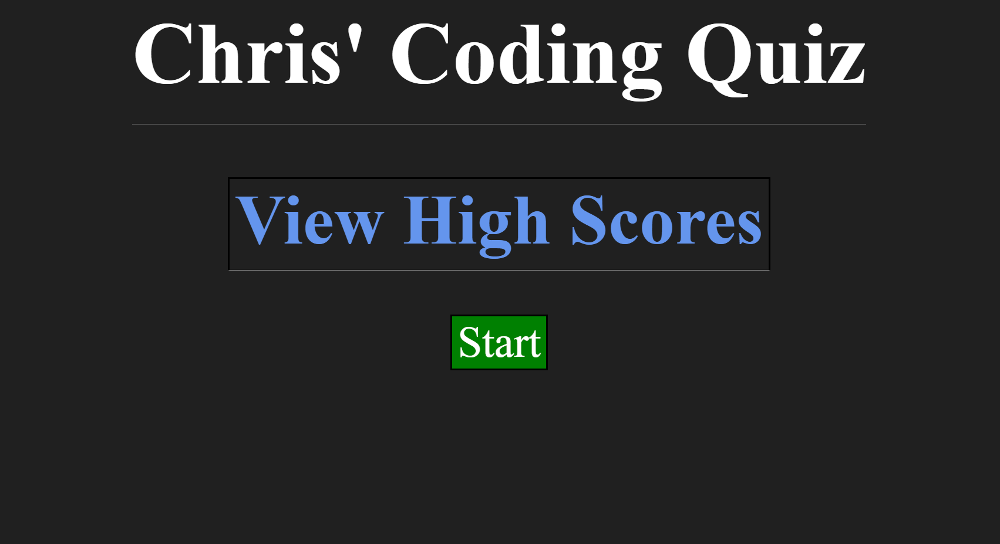
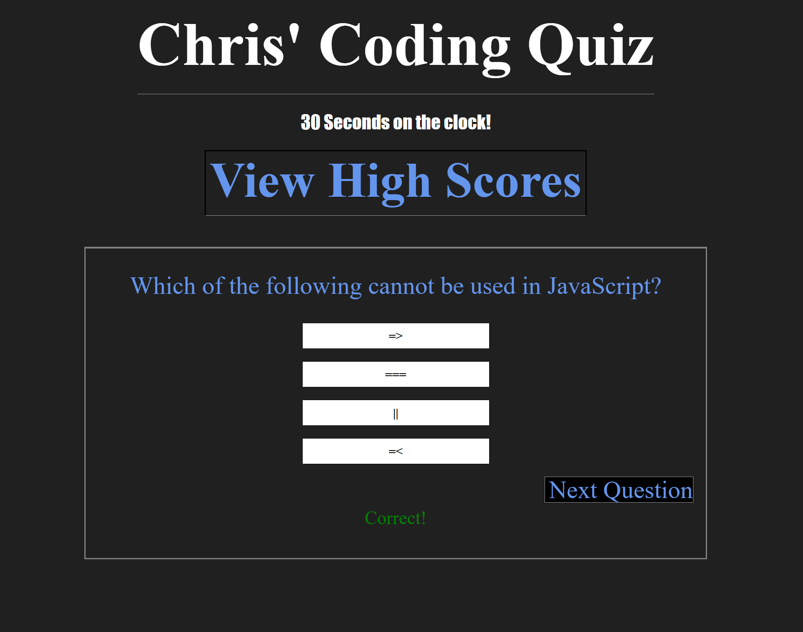
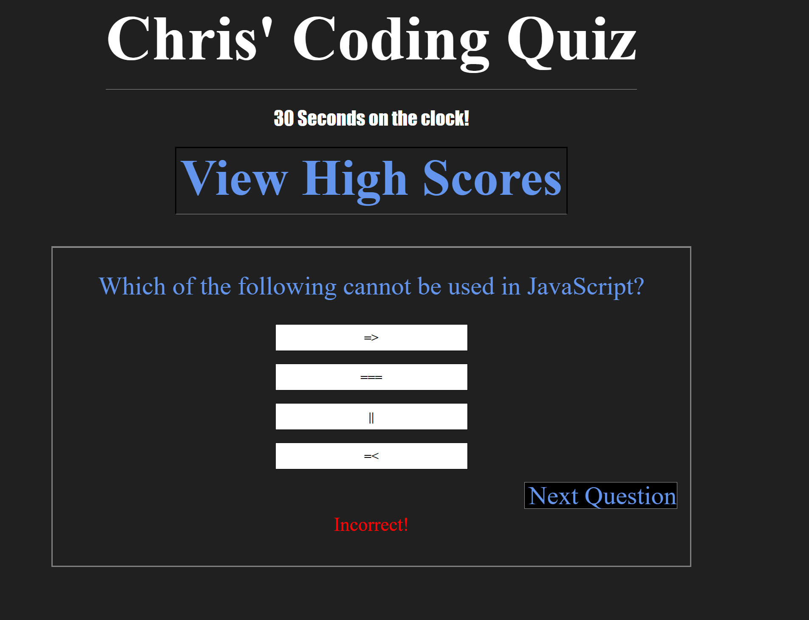
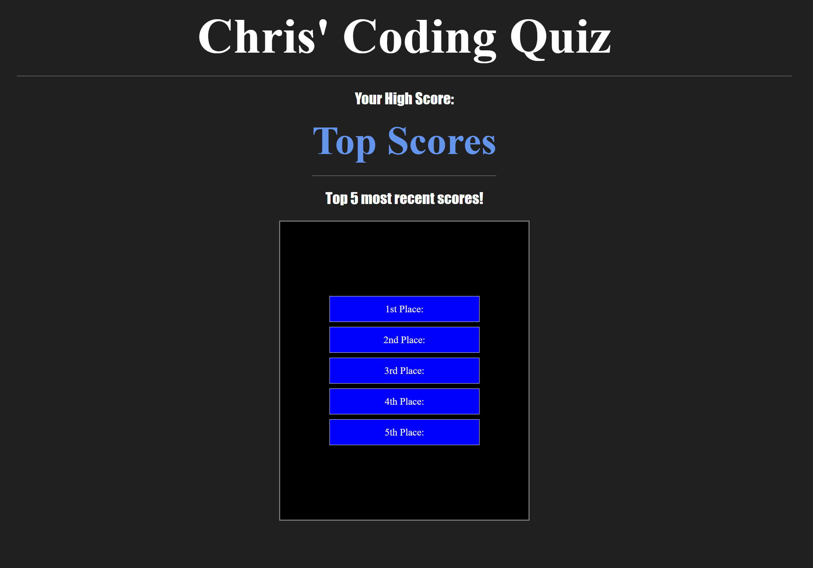

# <Timed-Coding-Quiz>

## Description

This is a project where the user will be prompted with a start button to begin a 30 second quiz in an effort to achieve a high score stored within the browser. JavaScript will be the primary language used. 

## Usage

# Please note that this is not yet functional. Submitting for dealine.

Upon loading the web page, the user should click on "Start". This will start a timer set at 30 seconds. Once the user selects an answer, a display message will show "Correct!" or "Incorrect!" based off the user's input. Each question answered incorrectly will deduct that time from the clock time, resulting in a lower score. At the end of the quiz, the user will then be able to enter their initials to be stored in the browser's history as a leaderboard. 

## Credits

Will update references as I take on this project. 

## Mock-Up Images

